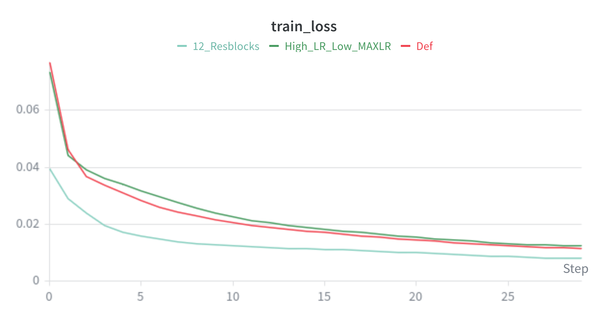
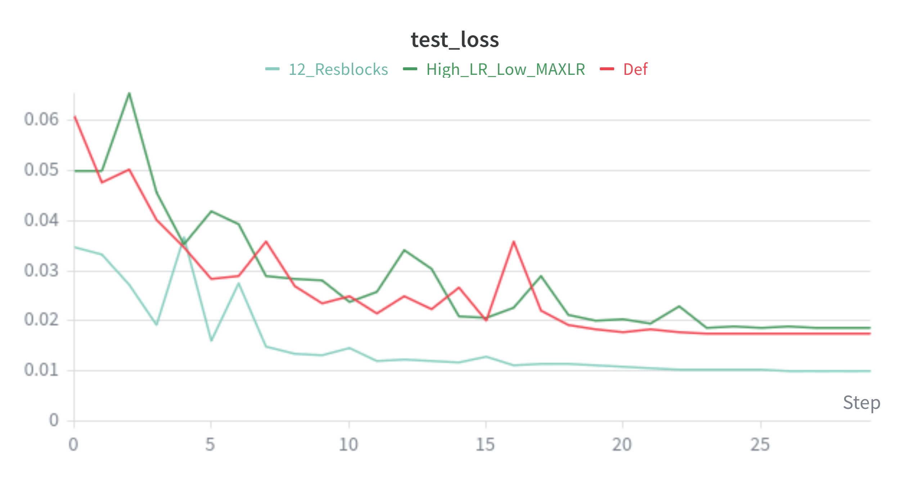

# Results
This file lays out the results achieved so far

## Distilled Stockfish Evaluation
So far training the model to imitate stockfish evaluation has shown promising results, achieving a MSE win probability loss of ~0.01.

To achieve these results I used hyperparameters: 

| Parameter | Run: Def | Run: High_LR | Run: 12_Res |
| :--- | :--- | :--- | :--- |
| **Res Blocks** | 8 | 8 | **12** |
| **Dataset Size** | ~6M Positions | ~6M Positions | **~40M Positions** |
| **LR** | 2e-5 | 5e-5 | 2e-5 |
| **Max LR** | 5e-4 | 2e-4 | 5e-4 |
| **Batch Size** | 1024 | 1024 | 1024 |
| **Weight Decay** | 1e-2 | 1e-2 | 1e-2 |

### Performance & Observations

The best run so far is the one that used 12 resblocks. While it used a larger dataset, its test loss is lower than the others train loss suggesting that this was primarily caused by the increased depth. Due to "Compute Power" I was not yet able to verify this with a run with 8 resblocks on the large dataset.

As you can see there are a lot large "spikes" in the test loss only. Likely causes of this are the lack of gradient smoothing and tactical volatility of chess ("bad" gradient update directly before calculating test loss caused by large number of tactical positions)

### Elo
While I have not yet tested it against enough humans/other engines to estimate an elo, using minimax on depth 3, 12_Resblocks was able to beat me (20xx lichess).

### Problems
#### Data Leakage
Currently duplicates aren't being erased which allows the same position from different games to end up in test and train datasets.
"random_split" allows positions from a single game to end up in both the training and test datasets. 
This isn't guaranteed to be a huge problem because positions from the same game are always some moves apart (at least 4, avg > 9). 
But it still remains that this temporal leakage into test data at least partially invalidates results.
Due to "Compute power" I am struggling to complete a run that doens't have these issues.

#### Hardware Constraints
Due to lack of hardware resources (30h+ training times during which I can't use my PC, crashes due to running out of system RAM) I am having trouble getting runs to verify hypotheses.

Current hardware: HDD, 16GB RAM, GTX 1660 ti

## Next Steps

### Resolve data leakage

### Test impact of deeper network on performance

### Estimate elo in controlled environment

### Implement reinforcement learning
